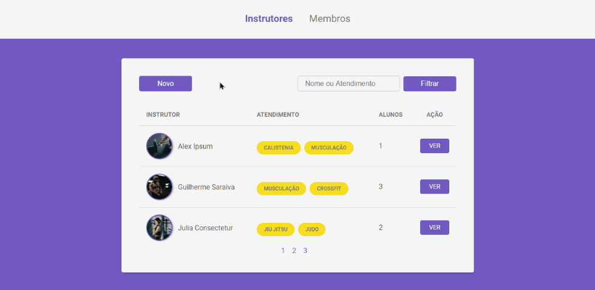

# Gym Manager

<p>Sistema web de gerenciamento de academia.</p>

<p>
  
  
  <a href="https://opensource.org/licenses/MIT">
    
  </a>
  <a href="https://github.com/martins-rafael/gym-manager/commits/master">
    
  </a>
</p>


## Tópicos 

[Sobre o Gym Manager](#sobre-o-gym-manager)

[Funcionalidades](#funcionalidades)

[Tecnologias](#tecnologias)

[Instalação e uso](#instalação-e-uso)

[Licença](#licença)

<br>

## Sobre o Gym Manager

O Gym Manager é uma aplicação web de gerenciamento de academia, responsável pelo controle de instrutores e membros. Desenvolvido durante o bootcamp [LaunchBase](https://rocketseat.com.br/launchbase) da [Rocketseat](https://rocketseat.com.br/). 

<p align="center">
  
</p>

<p align="center">
  
</p>

<br>

## Funcionalidades

- [X] Criar, visualizar, editar e apagar instrutores e membros.
- [X] Filtrar instrutores e membros.
- [X] Paginação.
- [X] Páginas dinâmicas com Nunjucks.
- [X] Banco de dados PostgreSQL.

<br>

## Tecnologias

As seguintes tecnologias foram utilizadas no desenvolvimento do projeto:

- [HTML](https://devdocs.io/html/)
- [CSS](https://devdocs.io/css/)
- [Javascript](https://devdocs.io/javascript/)
- [Node](https://nodejs.org/en/)
- [Express](https://expressjs.com/)
- [Nunjucks](https://mozilla.github.io/nunjucks/)
- [PostgreSQL](https://www.postgresql.org/)

<br>

## Instalação e uso

Para rodar a aplicação, você precisa ter instalado em sua máquina o [Node](https://nodejs.org/en/), o [Postgres](https://www.postgresql.org/) e o [Postbird](https://www.electronjs.org/apps/postbird).

Siga os passos abaixo:

1) Abra um terminal e copie este repositório com o comando
    ```
    git clone https://github.com/martins-rafael/gym-manager.git
    ```
    ou use a opção de download.

2) Entre na pasta com 
    ```
    cd gym-manager
    ```

3) Instale as dependências
    ```
    npm install
    ```
    
4) Utilizando a ferramenta Postbird, crie o banco de dados "gymmanager" **através da query** ```CREATE DATABASE gymmanager```. 

5) Crie a tabela com o nome **instructors** que possua os seguintes campos:
- name: text;
- avatar_url: text;
- gender: text;
- services: text;
- birth: timestamp without time zone;
- created_at: timestamp without time zone;

6) Agora crie a tabela com o nome **members** que possua os campos abaixo:
- name: text;
- avatar_url: text;
- email: text;
- gender: text;
- birth: timestamp without time zone;
- blood: text;
- weight: integer;
- height: integer;
- instructor_id: integer;

7) Para configurar a conexão com o banco de dados, abra o arquivo ```db.js``` dentro da pasta ```src/config``` e edite a **linha 5** com o password cadastrado durante a instalação do Postgres.
    ```js
    // conexão com banco de dados
    const { Pool } = require('pg')

    module.exports = new Pool ({
    user: 'postgres', // default user
    password: '0000', // altere com sua senha do postgres
    host: 'localhost',
    port: 5432,
    database: 'gymmanager'
})
    })
    ```

8) Rode a aplicação
    ```
    npm start
    ```

<br>

## Licença

Esse projeto está sob a licença MIT. Veja o arquivo [LICENSE](/LICENSE) para mais detalhes.

---

Feito com :purple_heart: by [Rafael Martins](https://github.com/martins-rafael)
